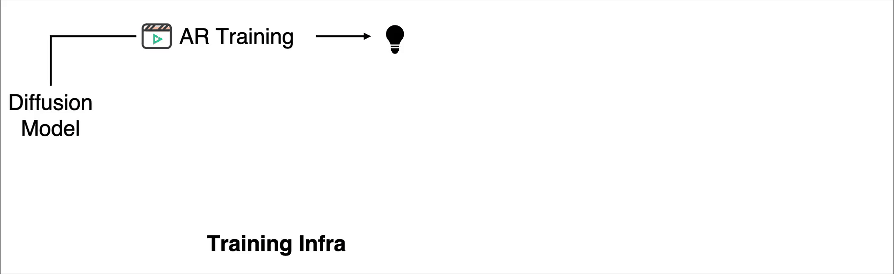
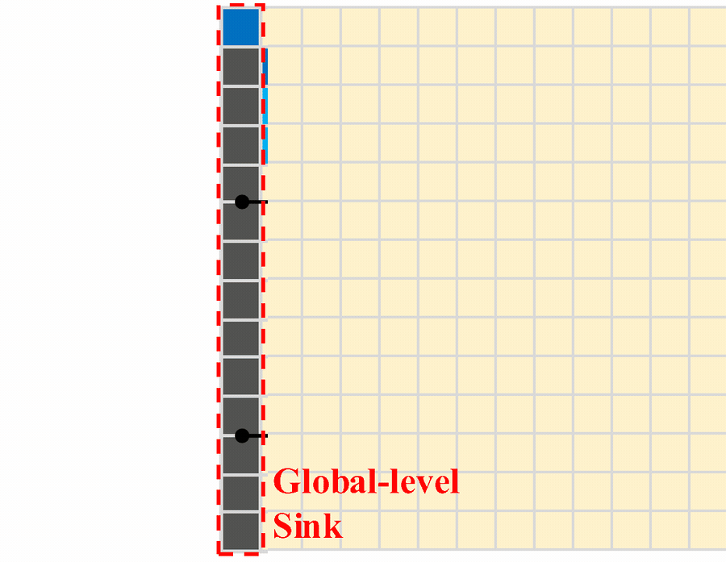
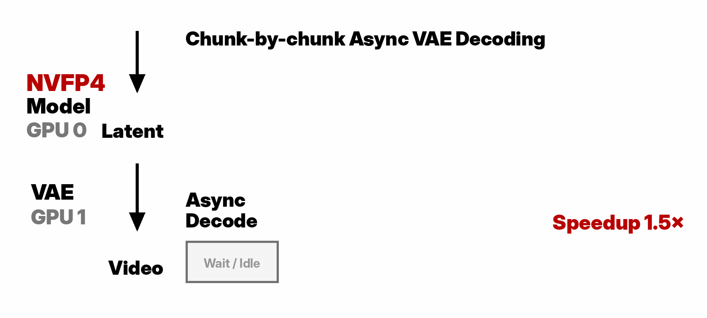
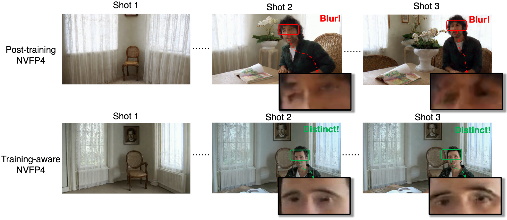
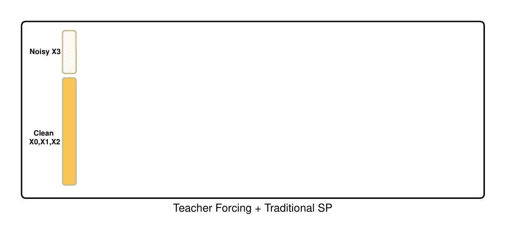

# Why Video Gen Is an Infra Problem

📝 [Yukang Chen](https://yukangchen.com), [Luozhou Wang](https://wileewang.github.io), [Wei Huang](https://aaron-weihuang.com), [Shuai Yang](https://andysonys.github.io), [Weian Mao](https://weianmao.github.io), [Song Han](https://hanlab.mit.edu/songhan)  
📅 May 26, 2026 · ⏱️ 8 min read

The first wave of modern video generation was about capability: Sora changed how people thought about the field by showing that scaled video models could move beyond short clips toward minute-long, high-fidelity videos across variable durations, resolutions, and aspect ratios [[1]](#ref-1). The next wave is about complexity: models such as Seedance 2.0 suggest that video generation is becoming multimodal, controllable, editable, audio-video synchronized, and low-latency [[2]](#ref-2).

This shift changes the question.

> Can the model generate a beautiful video? → Can the system generate a long, consistent, controllable video under real memory, latency, and deployment constraints?

That is why I think video generation is becoming an infrastructure problem. A good video model is still essential, but it is no longer the whole story. The user does not experience a model in isolation. The user experiences a system that has to remember, decode, schedule, compress, parallelize, and deliver pixels.

**A beautiful demo proves capability. Infrastructure turns that capability into something long, fast, stable, affordable, and deployable.**

## Contents

1. [A beautiful demo is not a usable video system](#1-a-beautiful-demo-is-not-a-usable-video-system)
2. [The longer the video, the more memory matters](#2-the-longer-the-video-the-more-memory-matters)
3. [Real-time means system, not just model FPS](#3-real-time-means-system-not-just-model-fps)
4. [Consistency is a memory problem](#4-consistency-is-a-memory-problem)
5. [Efficiency is a deployment problem](#5-efficiency-is-a-deployment-problem)
6. [Training and serving must be designed together](#6-training-and-serving-must-be-designed-together)
7. [LongLive 2.0 as a case study](#7-longlive-20-as-a-case-study)
8. [Closing: Video Gen Is an Infra Problem](#closing-video-gen-is-an-infra-problem)

## 1. A beautiful demo is not a usable video system

A beautiful sample is the starting point, not the finish line. It shows that the model has learned motion, appearance, and some notion of physical or semantic structure. But a usable video system has to answer harder questions: can it keep a character consistent for a minute? Can it generate the next shot without forgetting the previous one? Can it return pixels fast enough for users to feel it is responsive? Can it run within a realistic memory and cost budget?

This is the difference between a *demo* and an *infrastructure*. A demo can be judged by one impressive output. Infrastructure is judged by what happens across many prompts, long durations, multiple shots, limited hardware, and real deployment constraints.

**Capability asks:** “Can we generate this video?”  
**Infrastructure asks:** “Can we generate it long, fast, stable, affordable, and repeatedly?”

This distinction matters because video generation is moving from isolated clips to systems that need memory, scheduling, compression, and serving logic. Once we care about real usage, the bottleneck is no longer only the denoising model.

<video controls muted playsinline loop preload="metadata" poster="blog_assets/cozy_red_room_poster.jpg"><source src="blog_assets/cozy_red_room.mp4" type="video/mp4"></video>

**Video 1.** A generated long video example. A demo like this shows capability, but turning it into a practical system requires memory, end-to-end latency optimization, and deployment-aware design.

## 2. The longer the video, the more memory matters

A tempting mental model is:

> If a model can generate a good 10-second video, then a 60-second video should just be six 10-second videos stitched together.

This is wrong. A 60-second video is not only longer; it changes the nature of the problem. Later parts of the video depend on earlier parts. A character should remain the same person. A room should preserve its layout. A camera motion should continue naturally. A shot transition should change what needs to change, but preserve what should remain global.

In other words, long video generation needs memory. The system has to decide what to remember, what to refresh, what to compress, and what to forget. Theoretical duration is not the same as effective duration: a model may technically produce 60 seconds of video, but useful memory, visual consistency, and deployment efficiency across those 60 seconds are separate questions.

Long video generation is not short video generation repeated over time. It is an online process with memory, scheduling, synchronization, and error accumulation.

## 3. Real-time means system, not just model FPS

In many-step diffusion pipelines, the DiT denoiser dominates latency, so it is natural to focus on reducing sampling steps or accelerating transformer throughput. But as video generation moves toward fewer steps, autoregressive decoding, KV caching, and low-precision inference, hidden system costs start to surface: VAE decoding, KV-cache updates, synchronization, memory transfer, and runtime scheduling.

CausVid illustrates this shift by turning bidirectional video diffusion into an autoregressive few-step generator, enabling streaming generation at 9.4 FPS on a single GPU with KV caching [[4]](#ref-4). LTX-Video shows a similar trend from another angle: it co-designs the Video-VAE and denoising transformer with a highly compressed latent space, reporting faster-than-real-time generation [[5]](#ref-5).

The key point is simple: users do not experience model-only FPS. Users experience end-to-end latency.

```text
VideoGen System =
    Tokenizer / VAE
  + Denoising Engine
  + Temporal Memory
  + Precision Runtime
  + Parallel Execution
  + Decoder Scheduler
```

Most discussions focus on the denoising engine. But in long video generation, VAE decoding, KV-cache movement, GPU synchronization, CPU-GPU transfer, and multi-shot scheduling can become large enough to change the architecture of the system.

> A video model is not truly fast unless the user receives pixels fast.



**Figure 1.** LongLive 2.0 as an end-to-end infrastructure. Training, few-step distillation, NVFP4 execution, KV-cache management, parallel dequantization, and asynchronous decoding are optimized together instead of being treated as separate components.

## 4. Consistency is a memory problem

Long-video consistency is often described as a quality problem, but it is also a memory problem. If the system cannot store, compress, retrieve, and update history properly, the model does not merely become slower; it forgets who the character is, where the scene is, and how the motion should evolve.

For multi-shot generation, memory is not uniform. Some memory should persist across the whole video, such as identity and long-horizon anchors. Some memory should be refreshed when the scene changes, such as local layout and current-shot context. This is why LongLive 2.0 uses both a global-level sink and a shot-level sink for streaming multi-shot inference.



**Figure 2.** Multi-shot attention sink for streaming multi-shot inference. The global-level sink remains across shots, while the shot-level sink is refreshed as the scene changes.

This also reframes KV-cache compression. It is not only about saving memory; it is about preserving enough useful working memory for the video to remain coherent. Quant VideoGen similarly identifies KV-cache memory as a key bottleneck for autoregressive video diffusion, where constrained KV-cache budgets can hurt long-horizon consistency in identity, layout, and motion [[6]](#ref-6).

> Memory efficiency and temporal consistency are the same problem viewed from two layers of the stack.

## 5. Efficiency is a deployment problem

Efficiency is not just about making one kernel faster. In deployment, every hidden cost becomes visible: decoding latents into pixels, moving data between devices, synchronizing workers, storing history, and serving multiple requests under a fixed hardware budget.

A common benchmarking mistake is to report denoising speed and treat VAE decoding as a fixed tax. For short videos, this approximation may be acceptable. For long videos, it becomes misleading. VAE decoding affects end-to-end latency, peak memory, streaming behavior, and the shape of the runtime pipeline.



**Figure 3.** Chunk-by-chunk asynchronous VAE decoding. The model can continue generating later latent chunks while the VAE decodes earlier chunks into video.

The same principle applies to low precision and KV-cache compression. These techniques only help deployment if their overhead does not create a new bottleneck. A compressed KV cache is useful only if dequantization is fast enough. A faster DiT is useful only if the VAE and data transfers do not dominate the tail latency.

> Efficiency is a system property, not a single-module benchmark.

## 6. Training and serving must be designed together

Another trap is to train in one world and serve in another. Low precision is often described as compression, but for long video generation it is also an alignment problem. In autoregressive video, quantization errors are not isolated: they can enter the generated history, be stored in the KV cache, and condition future chunks.



**Figure 4.** Training-aware NVFP4 versus post-training NVFP4. Training-inference alignment helps preserve visual details across multiple shots.

The same co-design principle also appears in distributed training. Adding more GPUs does not automatically make long-video training efficient. Under teacher forcing, a naive sequence-parallel layout can place clean history on many ranks while concentrating the noisy target and loss on one rank, creating computation imbalance.



**Figure 5.** Teacher forcing plus traditional sequence parallelism can create computation imbalance: clean chunks are distributed across ranks, while the noisy target and loss concentrate on one rank.

This is why training and serving should be treated as one design problem. The numerical format, KV cache, LoRA handling, dequantization kernels, teacher-forcing layout, and distributed partitioning all affect whether the final system is stable and efficient [[3]](#ref-3).

> Good infrastructure reduces the gap between how a model is trained and how it is actually used.

## 7. LongLive 2.0 as a case study

LongLive 2.0 is our attempt to treat long video generation as an end-to-end infrastructure problem rather than a collection of isolated optimizations. The goal is not only to generate longer videos, but to make the full pipeline faster, lighter, more stable, and more practical.

| System challenge | LongLive 2.0 design |
|---|---|
| Long duration | Autoregressive long-video generation and multi-shot inference |
| Consistency across shots | Global-level and shot-level attention sinks |
| End-to-end latency | Parallel dequantization and asynchronous VAE decoding |
| Memory and deployment cost | NVFP4 W4A4 inference and NVFP4 KV cache |
| Training scale | Balanced sequence parallelism and chunk-aware VAE encoding |
| Few-step generation | Standalone DMD LoRA for distillation and deployment flexibility |

The broader lesson is that each component solves a different systems bottleneck, but the components only matter when they work together. Memory without fast dequantization is slow. Low precision without training-inference alignment is unstable. More GPUs without a balanced layout can waste computation. Fast denoising without asynchronous decoding may still fail to deliver pixels quickly.

This is why LongLive 2.0 targets training and inference together: Balanced sequence-parallel training, NVFP4 training and inference, W4A4 execution, NVFP4 KV cache, parallel dequantization, and asynchronous VAE decoding are part of the same system [[3]](#ref-3).

## Closing: Video Gen Is an Infra Problem

The Sora moment showed that video generation could scale into long, high-fidelity visual worlds. The Seedance moment points toward controllable, multimodal, interactive video systems. The next step is infrastructure.

The next generation of video models will not be defined only by better denoisers. It will be defined by systems that can remember longer, decode faster, quantize safely, parallelize naturally, and deliver pixels under real latency and memory budgets.

**Video generation is becoming an infrastructure problem.**

## References

1. <span id="ref-1"></span>**Video generation models as world simulators.** OpenAI. *OpenAI Blog*, 2024. [OpenAI Blog](https://openai.com/index/video-generation-models-as-world-simulators/)
2. <span id="ref-2"></span>**Seedance 2.0: Advancing Video Generation for World Complexity.** Team Seedance, De Chen, Liyang Chen, Xin Chen, Ying Chen, Zhuo Chen, et al. *arXiv preprint*, 2026. [arXiv:2604.14148](https://arxiv.org/abs/2604.14148)
3. <span id="ref-3"></span>**LongLive-2.0: An NVFP4 Parallel Infrastructure for Long Video Generation.** Yukang Chen, Luozhou Wang, Wei Huang, Shuai Yang, Bohan Zhang, Yicheng Xiao, Ruihang Chu, Weian Mao, Qixin Hu, Shaoteng Liu, Yuyang Zhao, Huizi Mao, Ying-Cong Chen, Enze Xie, Xiaojuan Qi, Song Han. *arXiv preprint*, 2026. [arXiv:2605.18739](https://arxiv.org/abs/2605.18739)
4. <span id="ref-4"></span>**From Slow Bidirectional to Fast Autoregressive Video Diffusion Models.** Tianwei Yin, Qiang Zhang, Richard Zhang, William T. Freeman, Frédo Durand, Eli Shechtman, Xun Huang. *IEEE/CVF Conference on Computer Vision and Pattern Recognition (CVPR)*, 2025. [arXiv:2412.07772](https://arxiv.org/abs/2412.07772)
5. <span id="ref-5"></span>**LTX-Video: Realtime Video Latent Diffusion.** Yoav HaCohen, Nisan Chiprut, Benny Brazowski, Daniel Shalem, Dudu Moshe, Eitan Richardson, Eran Levin, Guy Shiran, Nir Zabari, Ori Gordon, Poriya Panet, Sapir Weissbuch, Victor Kulikov, Yaki Bitterman, Zeev Melumian, Ofir Bibi. *arXiv preprint*, 2025. [arXiv:2501.00103](https://arxiv.org/abs/2501.00103)
6. <span id="ref-6"></span>**Quant VideoGen: Auto-Regressive Long Video Generation via 2-Bit KV-Cache Quantization.** Haocheng Xi, Shuo Yang, Yilong Zhao, Muyang Li, Han Cai, Xingyang Li, Yujun Lin, Zhuoyang Zhang, Jintao Zhang, Xiuyu Li, Zhiying Xu, Jun Wu, Chenfeng Xu, Ion Stoica, Song Han, Kurt Keutzer. *arXiv preprint*, 2026. [arXiv:2602.02958](https://arxiv.org/abs/2602.02958)
